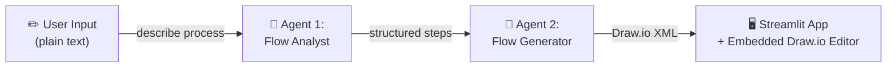

# 🔀 FlowGen AI — Editable Flow Diagrams from Text

> **Generate fully editable Draw.io flow diagrams from plain-text descriptions, powered by Mistral AI Agents.**
>
> *Built by **Team humanize** for the Mistral AI Hackathon*

[](https://mistral.ai)
[](https://streamlit.io)
[](https://langchain.com)

---

## 🎯 The Problem

When you ask any AI code assistant today to create a flow chart, you get one of these:

| Output Type | Limitation |
|---|---|
| 🖼️ Static image (PNG/SVG) | Cannot edit nodes, labels, or layout |
| 📝 Mermaid / Markdown | Requires rendering tools; not drag-and-drop editable |
| 📄 Text outline / bullet list | Not a diagram at all |

**None of these are truly editable.** Professionals need flow diagrams they can refine, rearrange, and share — not locked-down images.

## ✅ Our Solution

**FlowGen AI** generates industry-standard **Draw.io XML** from plain-text process descriptions. The output is a **fully editable, drag-and-drop flow diagram** compatible with:

- [diagrams.net](https://app.diagrams.net) (Draw.io)
- Confluence Draw.io plugin
- VS Code Draw.io extension
- Any tool that supports `.drawio` files

### Key Differentiator

> 💡 **Other tools give you a picture. FlowGen AI gives you an editable diagram.**

---

## 🏗️ Architecture — Powered by Two Mistral AI Agents

At the core of FlowGen AI is a **two-agent pipeline** built using the [Mistral Agent Builder](https://console.mistral.ai/) on the **Mistral Medium Latest** model. Each agent is a specialized, purpose-built AI — designed and configured in the Agent Builder — that handles one stage of the transformation. They chain together to go from raw text to a production-ready diagram.



---

### 🤖 Agent 1: Flow Analyst (Mistral AI)

> **Purpose:** Transform unstructured, conversational text into a clean, logical process breakdown.

Users describe processes in messy, natural language — *"I go to market, buy veg, if it rains I take a cab, otherwise I walk home"*. This isn't something you can directly convert to a diagram. The **Flow Analyst** agent acts as an intelligent process consultant:

- **Identifies discrete steps** from free-form text
- **Recognizes decision points**, branches, and parallel paths
- **Orders steps sequentially** with clear transitions (→ go to Step N)
- **Resolves ambiguities** in the user's description
- **Outputs a numbered step list** that is structured enough for machine processing

**Example transformation:**
```
Input:  "I go to market, buy veg, if it rains I take a cab otherwise walk home"

Output: 1. START → go to Step 2
        2. Go to market → go to Step 3
        3. Buy vegetables → go to Step 4
        4. Is it raining? → Yes: go to Step 5, No: go to Step 6
        5. Take a cab home → go to Step 7
        6. Walk home → go to Step 7
        7. END
```

---

### 🤖 Agent 2: Flow Generator (Mistral AI)

> **Purpose:** Convert the structured step list into valid, well-laid-out Draw.io XML.

This agent is trained to produce `<mxfile>` XML — the native format of Draw.io / diagrams.net. It doesn't just wrap text in XML tags; it:

- **Creates proper diagram nodes** — rectangles for process steps, diamonds for decisions, ellipses for start/end
- **Draws directed edges** between nodes with correct source/target references
- **Calculates spatial layout** — positions nodes with proper x/y coordinates so the diagram doesn't overlap
- **Applies consistent styling** — shapes, colors, and fonts that match professional flow chart conventions
- **Produces valid `<mxGraphModel>` XML** that can be opened in any Draw.io-compatible tool

**Output format:**
```xml
<mxfile>
  <diagram name="Flow">
    <mxGraphModel>
      <root>
        <mxCell id="n1" value="START" style="shape=ellipse;..." />
        <mxCell id="n2" value="Go to market" style="shape=rectangle;..." />
        <mxCell id="e1" edge="1" source="n1" target="n2" style="edgeStyle=..." />
        <!-- ... more nodes and edges -->
      </root>
    </mxGraphModel>
  </diagram>
</mxfile>
```

---

### 🔗 Why Two Agents Instead of One?

Splitting the work into two specialized agents produces **significantly better results** than a single prompt:

| | Single Agent | Two-Agent Pipeline ✅ |
|---|---|---|
| **Text understanding** | Often misinterprets complex flows | Dedicated analyst ensures correct logic |
| **XML quality** | Mixes reasoning with formatting, causing errors | Generator focuses purely on valid XML |
| **Decision handling** | Frequently drops branches | Analyst explicitly maps all paths |
| **Reliability** | Inconsistent output format | Each agent has a narrow, well-defined task |

The Streamlit app then renders the XML inside an **embedded Draw.io editor**, making the output immediately editable — no extra tools needed.

---

## 🚀 Quick Start

### Prerequisites

- Python 3.10+
- A Mistral AI API key

### Installation

```bash
# Clone the repo
git clone https://github.com/your-username/mistral-hackathon-flowgen.git
cd mistral-hackathon-flowgen

# Create and activate virtual environment
python -m venv .venv
.venv\Scripts\activate        # Windows
# source .venv/bin/activate   # macOS/Linux

# Install dependencies
pip install -r requirements.txt
```

### Configuration

Create a `.env` file in the project root:

```env
MISTRAL_API_KEY=your_mistral_api_key_here
MISTRAL_FLOWANALYST_AGENT_ID=your_flow_analyst_agent_id_here
MISTRAL_FLOWGEN_AGENT_ID=your_flow_generator_agent_id_here
```

### Run

```bash
streamlit run app.py
```

The app will open at `http://localhost:8501`.

---

## 📁 Project Structure

```
mistral-hackathon-flowgen/
├── app.py                  # Streamlit UI with embedded Draw.io editor
├── generate_flow_chart.py  # Flow chart generation logic
├── llm_factory.py          # Mistral AI agent invocation layer
├── requirements.txt        # Python dependencies
├── .env                    # API keys & agent IDs (not committed)
└── README.md               # This file
```

## 📦 Dependencies

| Package | Purpose |
|---|---|
| `mistralai` | Mistral AI SDK for agent invocations |
| `python-dotenv` | Load API keys from `.env` file |
| `langchain-core` | Prompt templating (ChatPromptTemplate) |
| `streamlit` | Web UI framework |

---

## 🎬 How to Use

1. **Open the app** — `streamlit run app.py`
2. **Describe your process** — Type a plain-text description like:
   > *"User opens the app, logs in with credentials, views the dashboard, generates a report, downloads it as PDF, and logs out"*
3. **Click Generate** — The button greys out while Mistral agents process your request
4. **Edit the diagram** — The generated flow chart appears in an embedded Draw.io editor. Drag nodes, edit labels, add shapes — it's fully interactive!
5. **Download** — Click the download button to save the `.drawio` file for use anywhere

---

## 🛠️ Tech Stack

- **AI**: [Mistral AI](https://mistral.ai) — Agents API for flow analysis and XML generation
- **Backend**: Python, LangChain Core
- **Frontend**: [Streamlit](https://streamlit.io) with embedded [Draw.io](https://diagrams.net) editor
- **Format**: Draw.io XML (`<mxfile>`) — the industry standard for editable diagrams

---

## 👥 Team

**Team humanize** — Building AI tools that make professional workflows more human-friendly.

---

## 📜 License

MIT License — see [LICENSE](LICENSE) for details.
